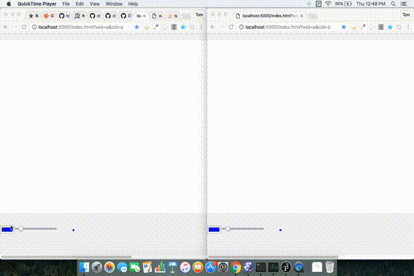

# web-whiteboard

A clojure/clojurescript whiteboard for interactive drawing in the browser

## Overview

This project is meant to create a clojure system that can allow multiple
clients to collaboratively draw together.

It is not meant to be a drawing tool like Photoshop, but simply a drawing
surface that allows you access to color and size with little else.



The next pieces will be:

1. Create a web server that can stream svg events via websockets -> DONE

2. Use [tangoclj](https://github.com/tomjkidd/tangoclj/tree/atomic-runtime)
   on the server to handle coordinating with multiple clients.

3. Grow out the idea some more to allow saving, replay, etc.

4. Improve the line drawing mode. [Jack Schaedler](https://jackschaedler.github.io/handwriting-recognition/)
   wrote a great article that demonstrates a few neat algorithms that
   are simple and would improve the perceived smoothness of strokes. -> DONE as :smooth-line mode
   
5. Create more drawing modes.

## Setup

Build the ClojureScript

```
lein cljsbuild once
```

Run the web server (which serves resources/public)

```
lein run
```

Then just go to the link

[http://localhost:5000/index.html?wid=a&cid=a](http://localhost:5000/index.html?wid=a&cid=a)

Open another tab and go to the link

[http://localhost:5000/index.html?wid=a&cid=b](http://localhost:5000/index.html?wid=a&cid=b)

This will connect two different clients (cid) to the same whiteboard (wid).
Drawing done in one should stream to the other.

## Demos

I created some demo versions of the system to plot out the course of work,
first designed in JavaScript to ensure a base layer of functionality. Next
I ported that demo to ClojureScript.

Build the ClojureScript

```
lein cljsbuild once
```

Run the web server (which serves resources/public)

```
./scripts/lein-ws-demo-server
```

Then, just go to either of the links

[http://localhost:5000/v001-js-demo.html](http://localhost:5000/v001-js-demo.html)

[http://localhost:5000/v002-cljs-demo.html](http://localhost:5000/v002-cljs-demo.html)

The two demos should show the evolution, v001 was pure JavaScript, while
while v002 was done with ClojureScript to get familiar.

I might follow up with a blog about my insights in doing the migration,
but for now they are available in order to keep the original ideas around.

## Prototyping

I had been playing around and before I wrote the actual code, I wanted to create
a sandbox that would allow me to quickly create a first pass at the websocket
code, for purposes of illustration.

Build the ClojureScript

```
lein cljsbuild once
```

Start the prototype server

```
./scripts/lein-ws-demo-server
```

Navigate to page

[http://localhost:5000/v003-cljs-ws-demo.html](http://localhost:5000/v003-cljs-ws-demo.html)

Connect a repl

```
./scripts/brepl
```

In the demo page, click on the *Connect to REPL* button

NOTE: Remember to use :cljs/quit to quit the REPL in a controlled manner!

## License

Copyright © 2016 Tom Kidd

Distributed under the Eclipse Public License either version 1.0 or (at your option) any later version.
